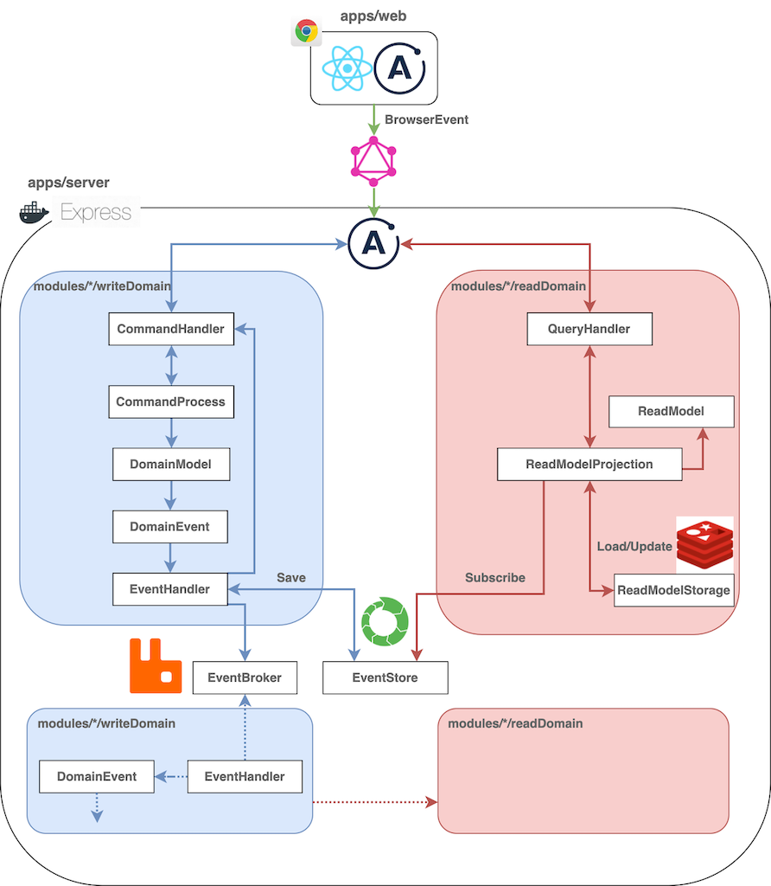
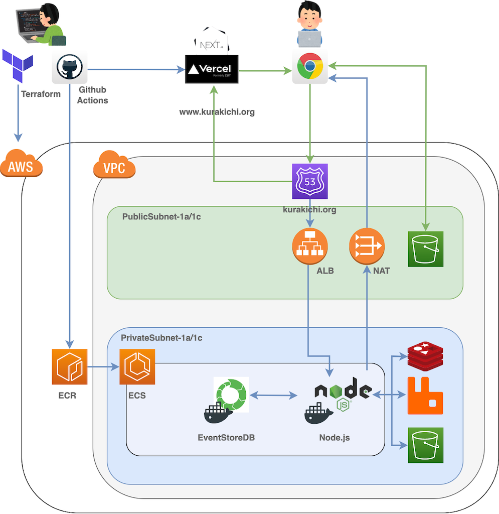

# kurakichi

[くらきち〜くらしのあんぜんきち〜](https://www.kurakichi.org) のソースコードです 

## 注意

現在アーキテクチャーの大幅な改変により、動作せず、デプロイも停止しております。 
nrwl/nx -> yarn workspace 
MongoDB -> EventStoreDB 

branch_oldに旧Versionのコードがあります

## Architecture Image

## Infrastructure Image

## Others

[くらきちのコンセプト](https://grey-jackal-f64.notion.site/d2c3c4d3249d43feafac8946cf7a42df)
